```{r}
#| label: setup
#| include: false

library(knitr)
library(tidyverse)
library(here)

options(
  htmltools.dir.version = FALSE,
  knitr.table.format = "html",
  knitr.kable.NA = '',
  dplyr.width = Inf,
  width = 250
)
knitr::opts_chunk$set(
  fig.path = "figs/",
  fig.width = 7.252,
  fig.height = 4,
  comment = "#>",
  fig.retina = 3
)

# Vehicle listings summary table
summary_dt_raw <- read_csv(here('data', 'listings_summary.csv')) %>%
  filter(vehicle_type %in% c('car', 'cuv', 'suv')) %>%
  filter(powertrain %in% c('cv', 'hev', 'bev', 'phev')) %>%
  mutate(
    vehicle_type = ifelse(vehicle_type == 'cuv', 'suv', vehicle_type),
    vehicle_type = ifelse(vehicle_type == 'car', 'Car', 'SUV')
  ) %>%
  group_by(powertrain, vehicle_type, inventory_type) %>%
  summarise(n = sum(n)) %>%
  ungroup() %>%
  mutate(n = round(n / 10^6, 1))

total_listings <- sum(summary_dt_raw$n)
summary_dt <- summary_dt_raw %>%
  pivot_wider(
    names_from = powertrain,
    values_from = n
  ) %>%
  select(
    Type = vehicle_type,
    Conventional = cv,
    Hybrid = hev,
    PHEV = phev,
    BEV = bev,
    inventory_type
  ) %>%
  mutate(PHEV = ifelse(is.na(PHEV), 0, PHEV)) %>%
  rename(ICEV = Conventional, HEV = Hybrid)
```




---




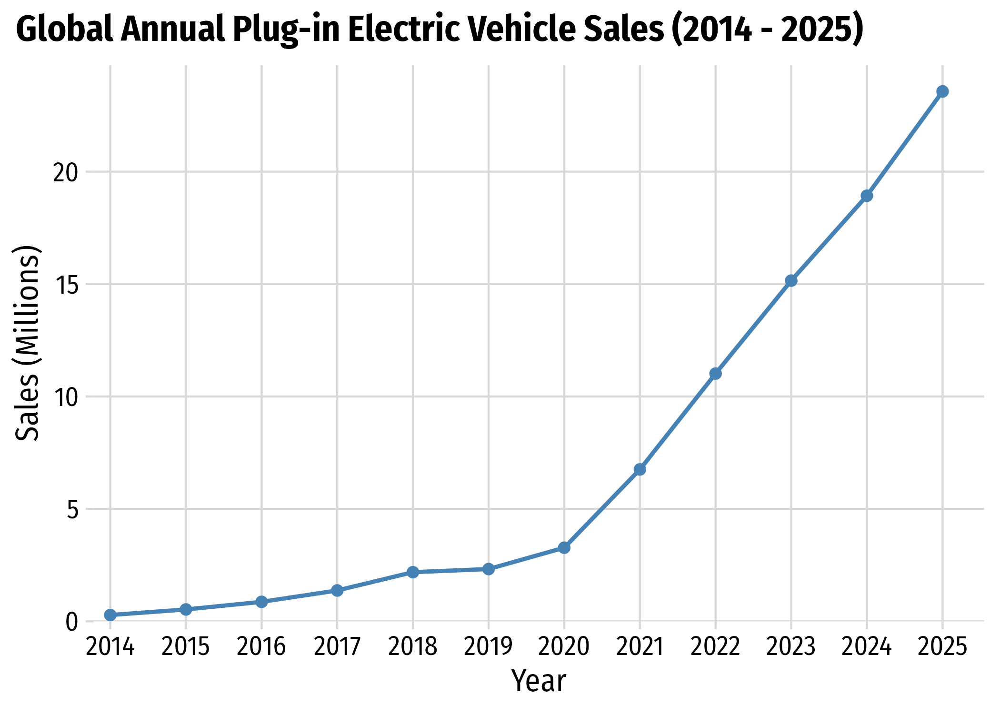{width=80%}

---




## China is driving the EV revolution

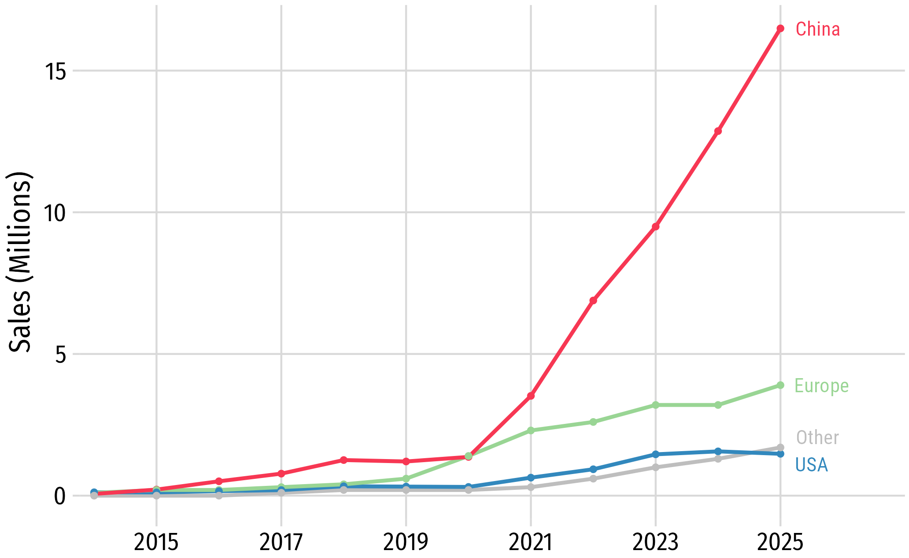{fig-align="center" width=75%}

---



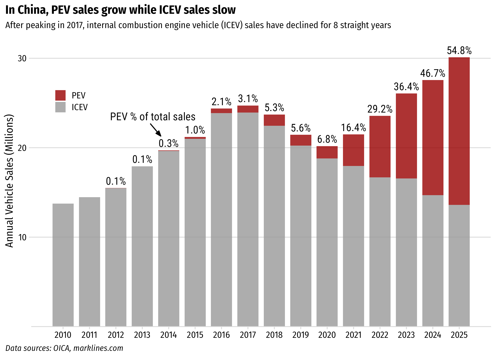{fig-align="center" width=80%}

---



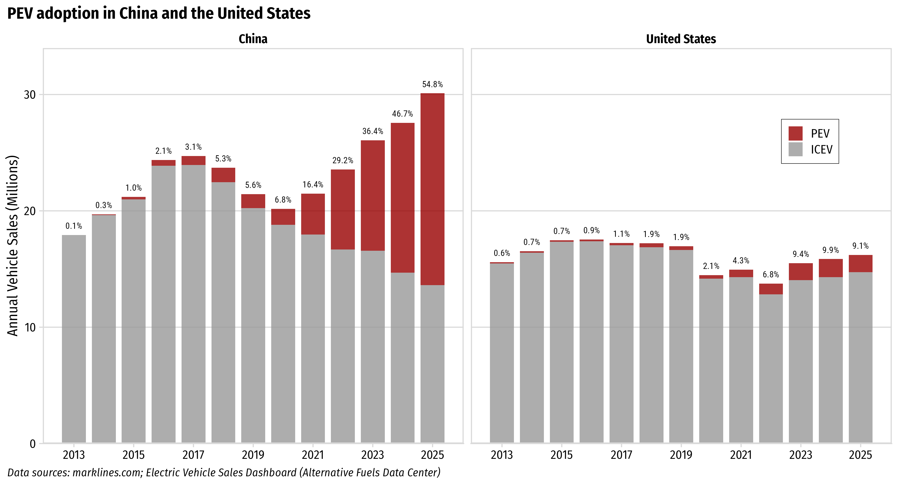{fig-align="center" width=100%}

---



### China offers more affordable BEVs across all range categories

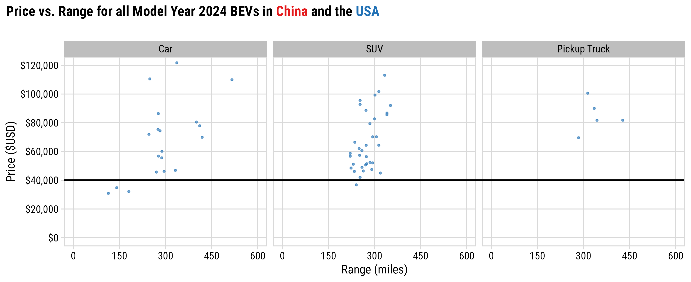{fig-align="center" width=100%}

Data scraped from autocango.com (China) and carsheet.io (USA)

Interactive version at <https://jhelvy.github.io/science-2025/>

---



### China offers more affordable BEVs across all range categories

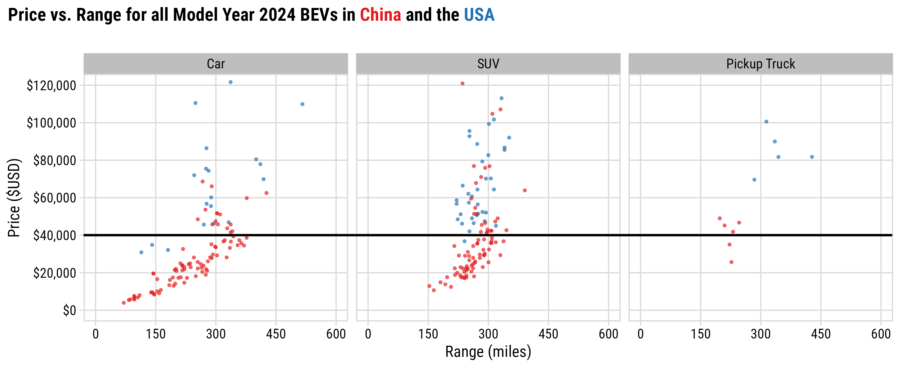{fig-align="center" width=100%}

Data scraped from autocango.com (China) and carsheet.io (USA)

Interactive version at <https://jhelvy.github.io/science-2025/>

---



## [China dominates mineral processing supply chain]{.center}

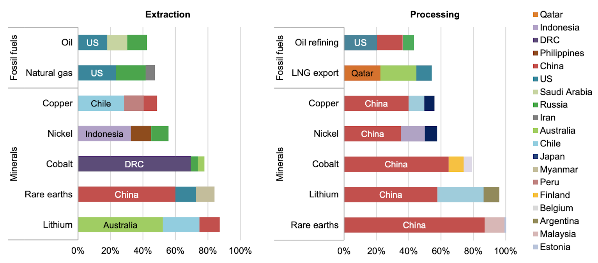{fig-align="center" width=100%}

[Source: <https://thegraduatepress.org/2022/04/01/how-china-came-to-dominate-the-supply-chain-of-rare-earths-and-critical-minerals/>]{.font60}

---





# [How did this happen?]{.font120}

::: {.fragment}

# [*It's the subsidies, right?!*]{.orange .font120}

:::

---

## [Estimated $230B in subsidies (2009 - 2023)]{.center}

<br>



<br><br><br><br>

[[https://www.csis.org/blogs/trustee-china-hand/chinese-ev-dilemma-subsidized-yet-striking](https://www.csis.org/blogs/trustee-china-hand/chinese-ev-dilemma-subsidized-yet-striking)]{.font60}

---

## [Estimated $230B in subsidies (2009 - 2023)]{.center}

<br>



<br><br><br><br>

[[https://www.csis.org/blogs/trustee-china-hand/chinese-ev-dilemma-subsidized-yet-striking](https://www.csis.org/blogs/trustee-china-hand/chinese-ev-dilemma-subsidized-yet-striking)]{.font60}

---





# [Institutions Matter]{.font120}

---



---



---



---





# Why are _Chinese_ firms making the best EVs?<br>(and not multinationals)

---



# The Chinese Joint Venture System

## 1980s: 以市场换技术 = "Exchange market for technology"

. . .

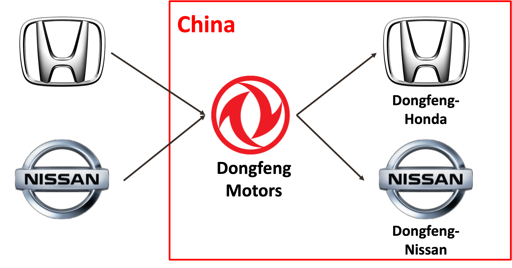{fig-align="center" width=70%}

::: {.notes}
Past research suggests system has largely failed to transfer technology

(Brandt & Thun, 2010; Feng, 2010; Howell, 2016; Huang, 2003; Lazonick & Li, 2012; Nam, 2011)
:::

---





### "这就像吸食鸦片一样，一旦你沾染上了就永远也无法戒掉。"

何光远, 中国前机械工业部部长

<br>

### "It's like opium. Once you've had it you will be addicted forever."

Guangyuan He, Former Minister of Machinery and Industry (Reuters, 2012)

---

# [Who's going to make the EVs?]{.center}

. . .

<br>

### [❌]{.font80} Multinationals don't want to share cutting-edge technology

. . .

<br>

### [❌]{.font80} Chinese JV partners lack incentives to innovate

. . .

<br>

### &#x2705; Indigenous non-JV firms

---



::: {.col width="55%"}

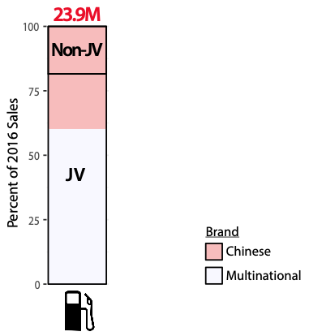{fig-align="center" width=100%}

:::

::: {.col}

<br>

### [Multinational OEMs dominate traditional auto sector through large JVs]{.center}

<br>

### [Indigenous non-JV firms dominate emerging EV sector]{.center}

<br><br><br>

[Helveston, J. P., Y. Wang, V. Karplus, E. Fuchs (2018) "Institutional Complementarities: The Origins of Experimentation in China's Plug-in Electric Vehicle Industry." _Research Policy_. 48(1), pg. 206-222]{.font70}

:::

---



::: {.col width="55%"}

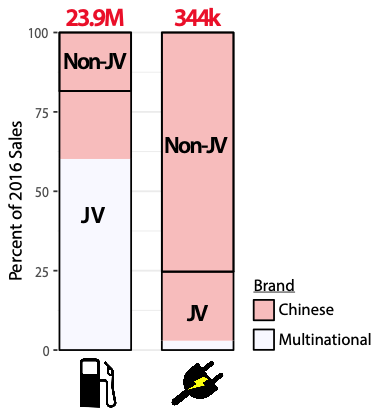{fig-align="center" width=100%}

:::

::: {.col}

<br>

### [Multinational OEMs dominate traditional auto sector through large JVs]{.center}

<br>

### [Indigenous non-JV firms dominate emerging EV sector]{.center}

<br><br><br>

[Helveston, J. P., Y. Wang, V. Karplus, E. Fuchs (2018) "Institutional Complementarities: The Origins of Experimentation in China's Plug-in Electric Vehicle Industry." _Research Policy_. 48(1), pg. 206-222]{.font70}

:::

---




# [EV Challenges in the US]{.center}

. . .

<br>

::: {.col width="30%"}
:::

::: {.col}

## 1) Policy environment

## 2) Consumer preferences

## 3) Affordability crisis

:::

---

# [**Decades of Policy Whiplash**]{.center}

::: {.col .fragment}

### Obama<br>(2009–2016)

- $7,500 EV tax credit
- Goal: 1M EVs by 2015
- DOE battery R&D investment

:::

::: {.col .fragment}

### Trump I<br>(2017–2020)

- Proposed eliminating EV tax credits
- Rolled back fuel economy standards
- Withdrew from Paris Agreement

:::

::: {.col .fragment}

### Biden<br>(2021–2024)

- IRA: $369B in clean energy investment
- Expanded EV credits, domestic content rules
- 100% EV federal fleet goal

:::

::: {.col .fragment}

### Trump II<br>(2025–Now)

- Gutted IRA
- Rolled back fuel economy standards

:::

---




# [EV Challenges in the US]{.center}

::: {.col width="30%"}
:::

::: {.col}

## 1) Policy environment

## [2) Consumer preferences]{.red}

## 3) Affordability crisis

:::

---

## [US buyers are more opposed to EVs than Chinese buyers]{.center}

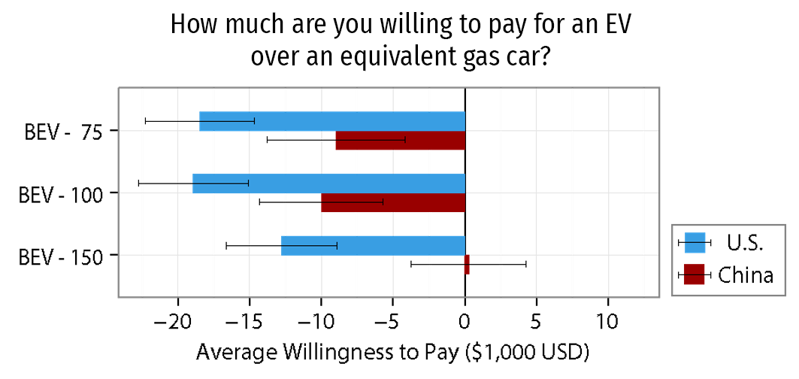{fig-align="center" width=80%}

[Helveston et al. (2015) "Will subsidies drive electric vehicle adoption? Measuring consumer preferences in the U.S. and China" _Transportation Research Part A: Policy and Practice_. 73, 96–112. DOI: [10.1016/j.tra.2015.01.002](https://www.sciencedirect.com/science/article/abs/pii/S0965856415000038)]{.font80}

---




### US buyers demand far more driving range than Chinese buyers

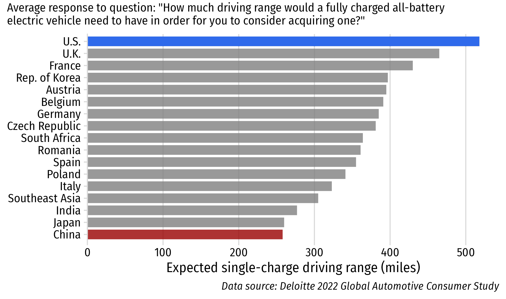{fig-align="center" width=80%}

---



---



---




# [EV Challenges in the US]{.center}

::: {.col width="30%"}
:::

::: {.col}

## 1) Policy environment

## 2) Consumer preferences

## [3) Affordability crisis]{.red}

:::

---



<!-- https://www.nytimes.com/interactive/2026/04/13/opinion/affordable-car-cost.html -->

---





# The EV "Deserts" of America

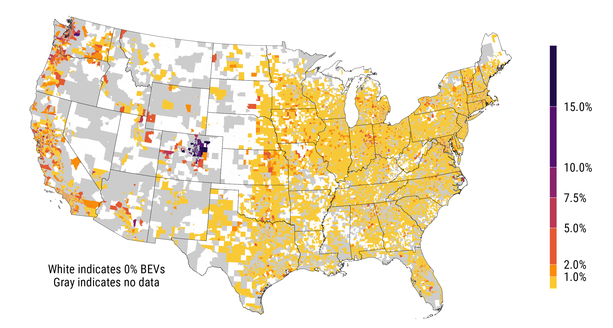{fig-align="center" width=80%}

[Data: **`r round(total_listings)`M vehicle listings** from 60k dealerships (2016 - 2025), marketcheck.com]{.font90}

---





## The EV "Deserts" of America

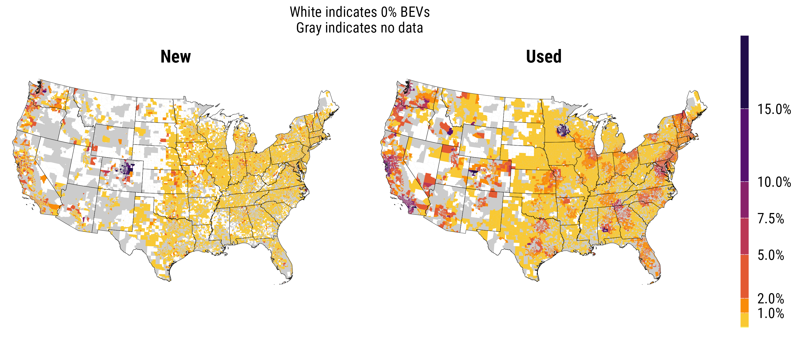{fig-align="center" width=100%}

[Data: **`r round(total_listings)`M vehicle listings** from 60k dealerships (2016 - 2025), marketcheck.com]{.font90}

---





# How should the US respond to Chinese EVs?

---

## [Bipartisan Response: **Ban Chinese tech**]{.center}

::: {.col}

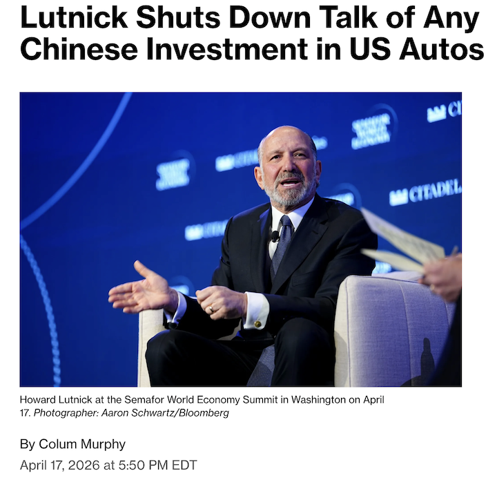{fig-align="center" width=100%}

:::

::: {.col}

### **Block imports**: Steep tariffs on imported Chinese EVs, batteries (First Biden, continued w/Trump)

<br>

### **Block investment**: Stricter Foreign Entities of Concern (FEOC) rules

<br>

### **Ban the tech**: Connected Vehicle Security Act of 2026 bans any connected vehicles with Chinese tech (import or domestic)

:::

---

<br><br><br>

::: {.col}

## [Option A]{.center}

## [**Exclude Chinese EVs**]{.center}

<br>

### - China "cheated" with subsidies

### - Need to protect local automakers from Chinese competition

:::

::: {.col .fragment}

## [Option B]{.center}

## [**Engage strategically**]{.center}

<br>

### - China built real competitive advantages in manufacturing and supply chains

### - Chinese EVs are winning markets, US OEMs are losing markets

### - Actually address security concerns

:::

---

::: {.col}

## [The Tesla Example:<br>Transparent Cybersecurity]{.center}

<br>

### China allowed Tesla in via<br>targeted compliance:

- Store vehicle data **within China**
- Restrict operations near **sensitive areas**
- Use only **government-approved** mapping systems (Baidu)

:::

::: {.col}

<br>

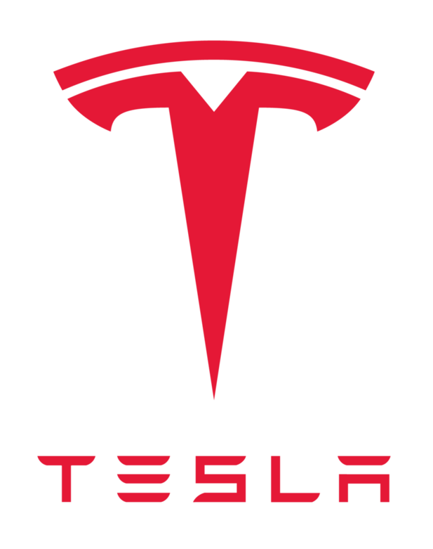{fig-align="center" width=70%}

:::

---

## [The European Model:<br>Block Imports, Welcome Chinese FDI]{.center}

<br>

::: {.center .font120}
Access to cutting-edge battery tech

Create local jobs

Increase supply chain resilience
:::

. . .

<br>

::: {.col}

### [**CATL**]{.center}

$7.6B battery plant in Debrecen<br>

100 GWh/year for Mercedes-Benz, BMW, Volkswagen

:::

::: {.col}

### [**BYD**]{.center}

First European EV manufacturing facility<br>

Producing BEVs and PHEVs for the European market

:::

---

# [US Opportunities]{.center}

::: {.col}

## [Technology Licensing Agreements]{.center}

<br>

### **Ford-CATL**: Licensing battery technology in a Michigan plant

### **Challenge**: CATL recently added to DOD's list of "Chinese military companies"

:::

::: {.col .fragment}

## [Chinese FDI<br>into U.S.]{.center}

<br>

### **Gotion batteries**: Multi-billion dollar investments in Illinois and Michigan

### **Challenge**: Uncertainty around Foreign Entities of Concern (FEOC) status

:::

---





# Consumers aren't waiting for Washington

---



---

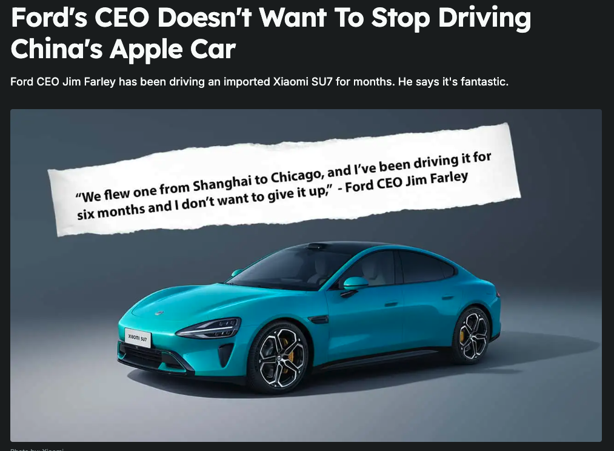{fig-align="center" width=80%}

---





## The U.S. risks becoming an **"island of tailpipes"**

---

# [Strategic Responses]{.center}

### 🇨🇦🇲🇽 **North American Integration**: Build sufficient scale through Canada and Mexico partnerships

. . .

### 📋 **Transparent Security Standards**: Develop compliance frameworks all connected vehicles must meet — *regardless of origin*

. . .

### 🔋 **Battery Manufacturing Focus**: Prioritize domestic production as platform for commercializing next-gen U.S. technologies

. . .

### 🤝 **Strategic Chinese Partnerships**: Pursue licensing agreements and FDI with targeted safeguards — not wholesale restrictions

. . .

### 📈 **Sustained Policy Support**: Restore and maintain IRA incentives long enough for investments to mature

---





<br><br>

# Thanks!

### Slides available at jhelvy.com/slides

<br><br><br><br><br><br>

jhelvy.com 

jph@gwu.edu 

@jhelvy 

---





# Extra Slides

---




## China's EV subsidies are on par with typical subsidies needed to start an industry

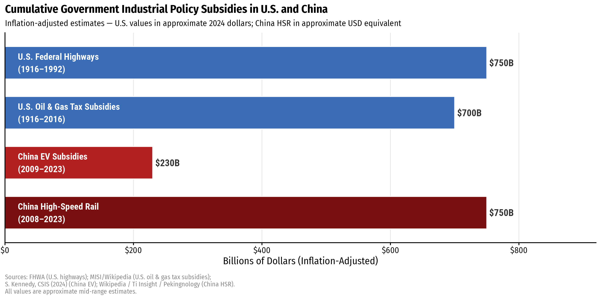{fig-align="center" width=100%}

---



### China offers more affordable BEVs across all range categories

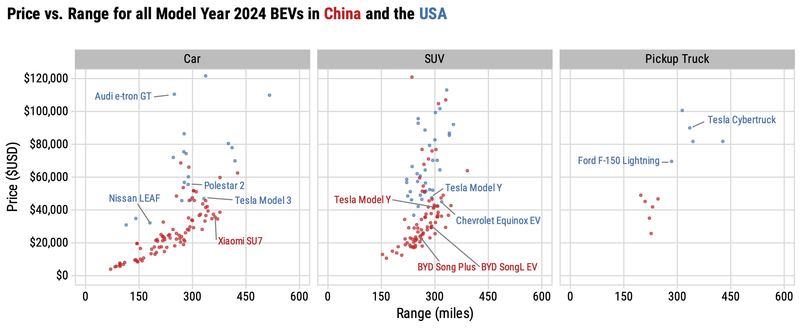{fig-align="center" width=100%}

Data scraped from autocango.com (China) and carsheet.io (USA)

Interactive version at https://jhelvy.github.io/science-2025/

---





# How many dealerships are carrying EVs?

---



## **4/5** dealers have _new_ BEV; **2/5** dealers have _used_ BEV

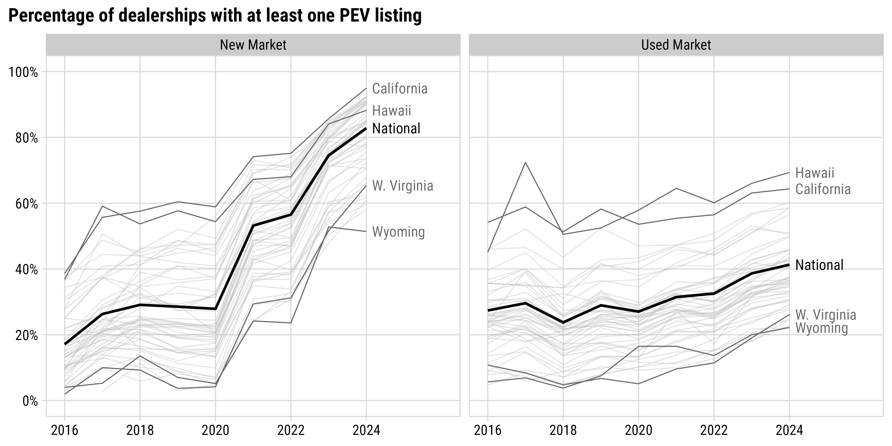{fig-align="center" width=95%}

---

::: {.col width="70%"}

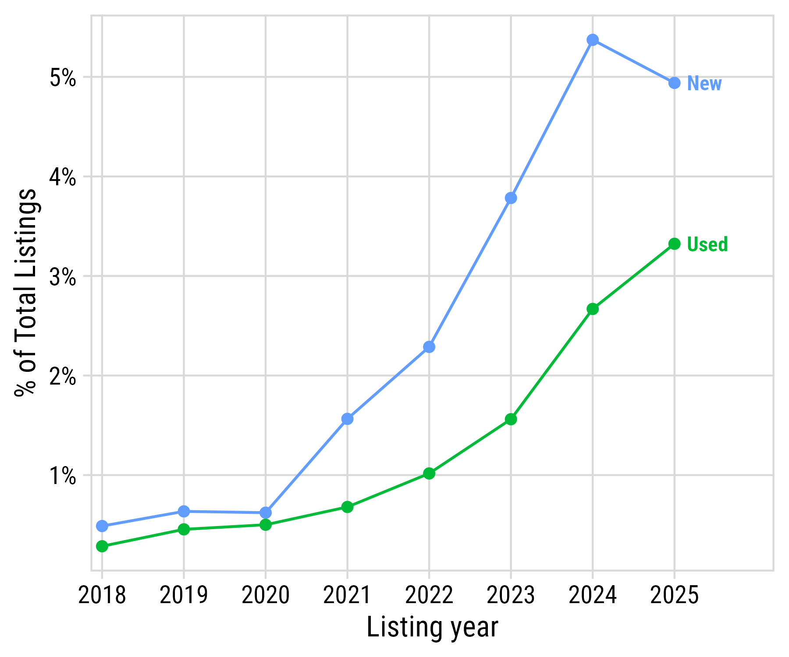{fig-align="center" width=100%}

:::

::: {.col}

## Most dealers carry very few EVs

:::

---

## [EV percentage of vehicle listings for $40-50k price bin]{.center}

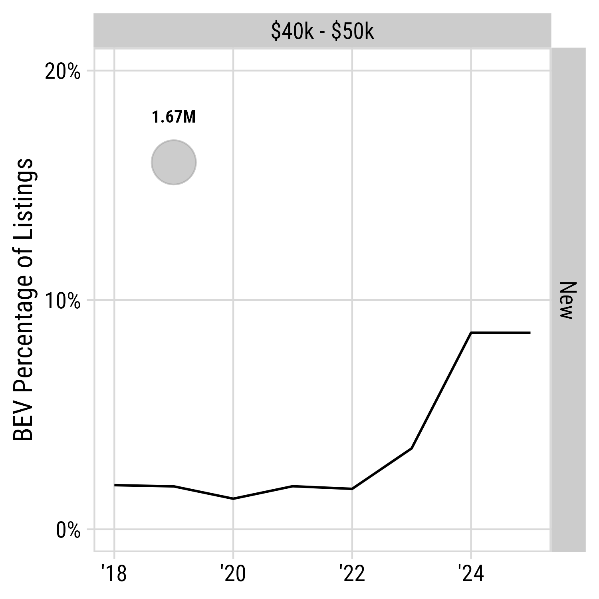{fig-align="center" width=40%}

---



<br>

## **Majority of BEV listings in high-price segments**

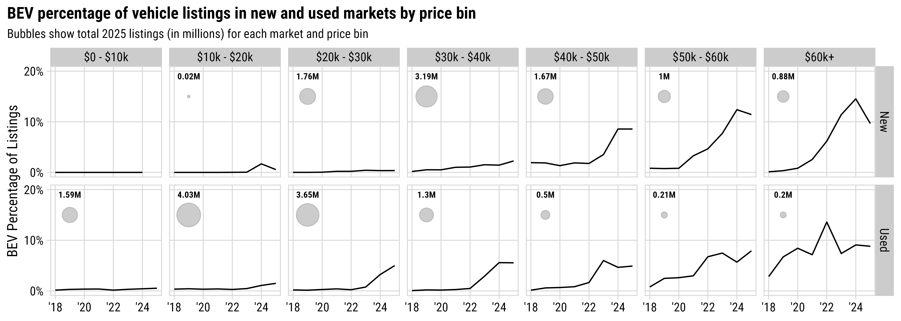{fig-align="center" width=100%}

---





# How hard is it to get to a PEV dealer?

---



### **Vehicle accessibility metric**:<br>Road travel time from census tract centroid to<br>nearest dealership with a target vehicle

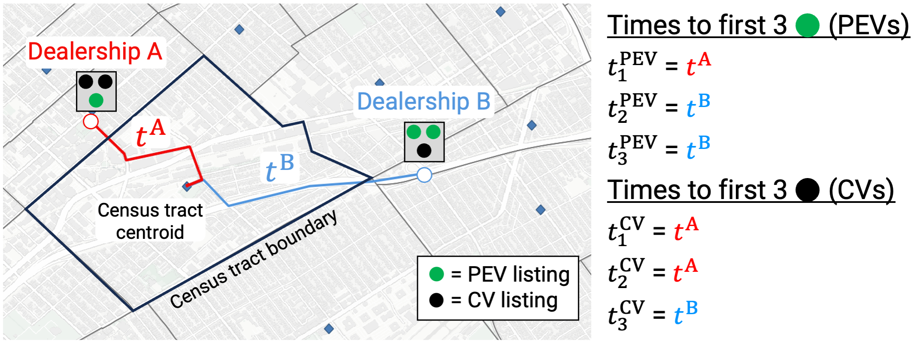{fig-align="center" width=100%}

*Road travel times obtained using Open Source Routing Machine (OSRM)

---



::: {.col width="65%"}

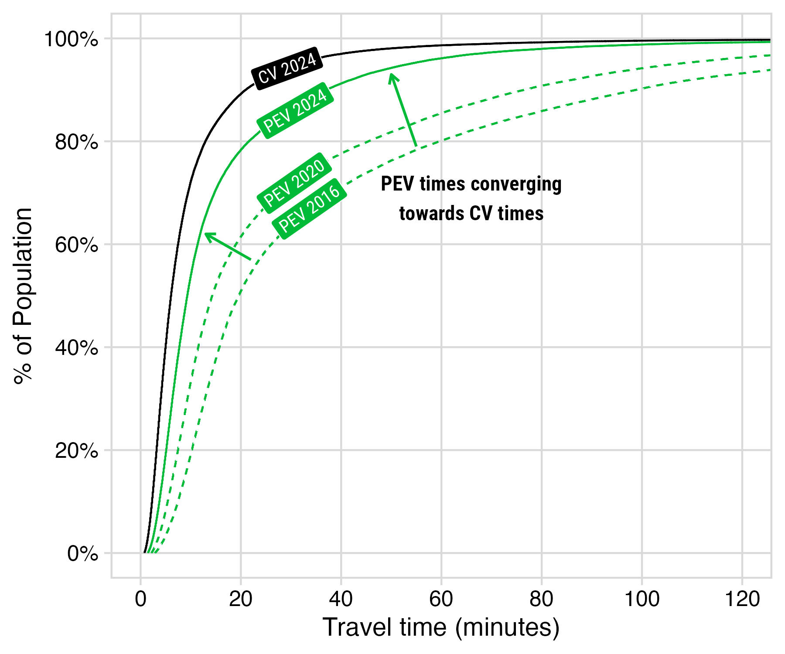{fig-align="center" width=100%}

:::

::: {.col}

## PEV travel times are converging towards conventional vehicle times

80% of pop:

- CV in ~12 min
- PEV in ~22 min (2024)
- PEV in ~60 min (2016)

:::

---



::: {.col width="65%"}

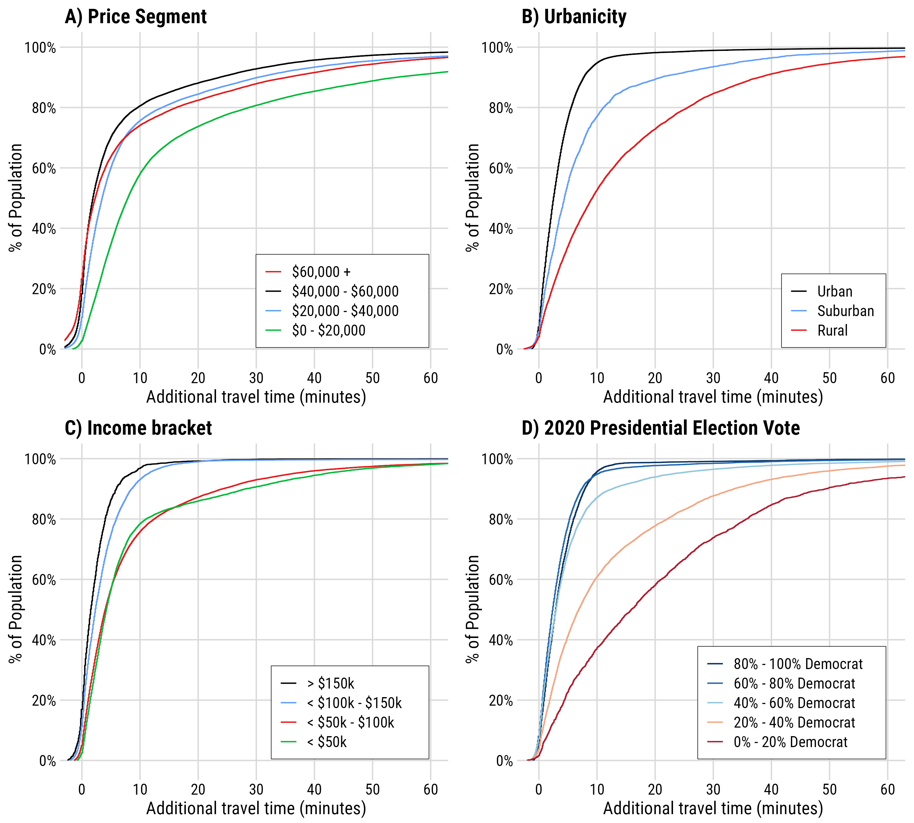{fig-align="center" width=100%}

:::

::: {.col}

### Additional travel times (PEV - CV) by demographic blocks shows disparities

Places with worse PEV access:

- Lower income areas
- Rural areas
- Republican strongholds

:::

---

### [**Local vehicle market**: Vehicles in 90 minute driving isochrone]{.center}

::: {.col width="40%"}

Combine ML algorithm of predicted household vehicle budget (using Census data) with local market characteristics

:::

::: {.col}

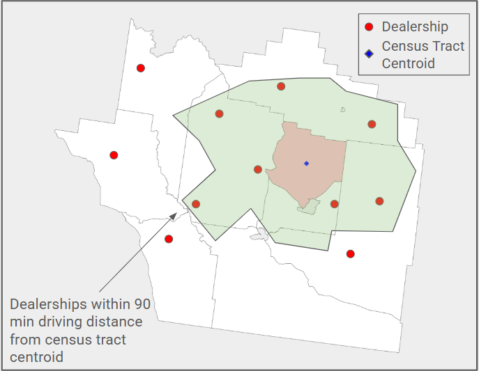{fig-align="center" width=100%}

:::

